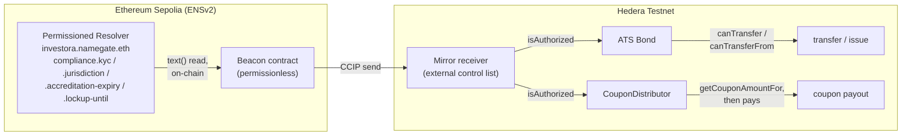

# NameGate

**ENS names as the compliance layer for a tokenized bond.**

An investor holds an ENS subname (`investora.namegate.eth`) on ENSv2/Sepolia. Their KYC status, jurisdiction, accreditation expiry and lock-up live on that name. A tokenized bond on Hedera, issued with Asset Tokenization Studio, reads that state before it will move a token or pay a coupon.

The investor owns the name. The issuer owns exactly one key on it. Neither can impersonate the other.

**Live app:** [namegate.vercel.app](https://namegate.vercel.app/). It reads straight from Sepolia and Hedera testnet, no backend cache. Built for [ETHOnline 2026](https://ethglobal.com/events/ethonline2026) (4-13 Sept 2026).

---

## How it works

**There is no trusted relayer.** The beacon calls `resolver.text(...)` on-chain in the same transaction that emits the CCIP message, and `publish()` is permissionless: anyone can trigger it. The relayer role collapses from "oracle" to "whoever pays the gas."

Only the KYC provider can write `compliance.kyc` (`authorizeTextRoles`, scoped to that one key), and the investor cannot repoint the resolver to forge their own status (`ROLE_SET_RESOLVER` withheld). The issuer's own write access is per-name, not global: three investors get full access, one has its `compliance.kyc` key permanently locked against the issuer to prove the lock actually holds (see [Tests](#tests-and-what-they-caught) below).

---

## Why ENS

Compliance data living outside the token is not new. [ERC-3643](https://eips.ethereum.org/EIPS/eip-3643) is Final, ONCHAINID already does expiring revocable claims, and Hedera integrated ERC-3643 into ATS in November 2025. NameGate doesn't compete with that stack. It plugs into it, shipping as an `IExternalControlList` provider inside ATS's own extension point.

What changes is the identity substrate. `investora.namegate.eth` is a human-readable, user-held, hierarchically-delegated name instead of an opaque identity contract address: legible to a compliance officer, and its permission structure inspectable by anyone.

The honest gap is against Hedera's native KYC, which is a single per-account bit. No jurisdiction, no expiry, no issuer attribution, set irreversibly at token creation.

---

## ENSv2 features used

Compliance properties are ENSv2 primitives, not strings parsed out of records:

| Compliance property                                | ENSv2 mechanism                                                                                                     |
| -------------------------------------------------- | ------------------------------------------------------------------------------------------------------------------- |
| Only the KYC provider may set KYC status           | `authorizeTextRoles`, Enhanced Access Control scoped to one key                                                     |
| Accreditation expires                              | Subname expiry, the name itself expires                                                                             |
| Investor cannot forge their own status             | `ROLE_SET_RESOLVER` withheld; subname points at the issuer's Permissioned Resolver                                  |
| Investor cannot sell their allocation              | Non-transferable subname                                                                                            |
| Issuer namespace                                   | Own `UserRegistry` subregistry under `namegate.eth`                                                                 |
| Issuer can be locked out of one field, on one name | `authorizeTextRoles` revoke + `revokeRootRoles` off the global write role, backfilled with explicit per-name grants |

---

## Why Hedera

Hedera already has native KYC and, since November 2025, ATS's own ERC-3643 integration. NameGate doesn't replace either. What Hedera adds beyond the token itself is native scheduling: the Schedule Service lets a coupon payout be created once and settle at expiry with no bot, no keeper network, and no separate automation subscription watching for it.

The honest gap: this same compliance layer could run on any EVM chain ATS supports. The one piece that's genuinely load-bearing for Hedera specifically is the Schedule Service integration, not the token standard itself.

---

## Hedera features used

| Feature                               | How it's used                                                                                                                                 |
| ------------------------------------- | --------------------------------------------------------------------------------------------------------------------------------------------- |
| Asset Tokenization Studio             | The bond itself: an ERC-3643 / ERC-1400 security token issued through ATS, not a custom token contract                                        |
| External Control List extension point | `Mirror` plugs into it as a live, permissionless receiver of ENS state, not a fork of the bond                                                |
| Schedule Service                      | `ScheduleCreateTransaction` with `waitForExpiry` wraps `distribute()`, so a coupon settles on its own                                         |
| Tinybar-native accounting             | `CouponDistributor` pays real HBAR, calibrated to Hedera's own 8-decimal tinybar rather than the 18-decimal weibar the JSON-RPC relay reports |

---

## Why Privy

Investors going through KYC-gated onboarding shouldn't also have to manage a seed phrase, and the issuer's automation shouldn't be trusted to call anything beyond two fixed contracts. Privy covers both: embedded wallets for investors logging in through the app, and a server-controlled organization wallet on the issuer side, restricted by policy to two allow-listed destinations.

The honest gap: this demo never touches Privy's cross-chain wallet abstraction, since it only ever needs to act on Sepolia and Hedera testnet. What's actually load-bearing here is the policy engine and the key quorum, not multi-chain routing.

---

## Privy features used

| Feature             | How it's used                                                                                                                                                                                                             |
| ------------------- | ------------------------------------------------------------------------------------------------------------------------------------------------------------------------------------------------------------------------- |
| Organization wallet | A server-controlled Privy wallet on the issuer side                                                                                                                                                                       |
| Wallet policy       | Restricts that wallet to `eth_sendTransaction` against only the beacon and distributor addresses; confirmed live by a rejected `policy_violation` on a disallowed destination, not just by reading the policy config back |
| Key quorum          | A 2-of-3 P-256 threshold gate in front of the organization wallet                                                                                                                                                         |
| Embedded wallets    | Investors connect through Privy login with no seed phrase                                                                                                                                                                 |

---

## Live on testnet

All addresses below are read live by the app and by the test suite. None of it is a mock.

| Contract                        | Chain          | Address                                                                                                 |
| ------------------------------- | -------------- | ------------------------------------------------------------------------------------------------------- |
| Issuer Permissioned Resolver    | Sepolia        | [`0x980ea4...17251`](https://sepolia.etherscan.io/address/0x980ea45e726bfdcb3ca242d767e7ba0acd817251)   |
| Issuer UserRegistry             | Sepolia        | [`0xbb8e69...840cc`](https://sepolia.etherscan.io/address/0xbb8e69d0d42300843cb75e224ee60b7fa4e840cc)   |
| Beacon (permissionless relayer) | Sepolia        | [`0x8eac05...594d63`](https://sepolia.etherscan.io/address/0x8eac059e7d80f5635094f5c3313e4361d2594d63)  |
| ATS Bond                        | Hedera testnet | [`0xA63036...5e9446`](https://hashscan.io/testnet/contract/0xA63036a8D19b2Cb75D0358e4970cA807585e9446)  |
| Mirror (external control list)  | Hedera testnet | [`0x0c6d0b...4e201c4`](https://hashscan.io/testnet/contract/0x0c6d0baefea27abac132900cf6ce93db44e201c4) |
| CouponDistributor               | Hedera testnet | [`0xb4df64...39df39`](https://hashscan.io/testnet/contract/0xb4df646f3078e8f10a043e032cbe04cfa839df39)  |
| IssuerPauseSwitch               | Hedera testnet | [`0xda8b16...16cca`](https://hashscan.io/testnet/contract/0xda8b1699364b733852035ff7a3e691db03316cca)   |
| HbarUsdPriceReader (Chainlink)  | Hedera testnet | [`0xb87adc...ae66bf5`](https://hashscan.io/testnet/contract/0xb87adc191b26bc82e4af562eb019faef5ae66bf5) |

Every contract is verified: the beacon on Etherscan, everything on Hedera via Sourcify. ENSv2 itself was under Immunefi audit through 2026-09-14.

---

## Beyond reading the ENS record

ATS's bond has no payout facet at all. `setCoupon` / `getCouponFor` / `getCouponAmountFor` handle declaration and entitlement calculation, never settlement. Everything below fills a real gap found by running the actual system, not a feature planned in advance:

- `CouponDistributor` is a ~60-line contract that actually pays a coupon, gated by the same control list the bond checks for transfers.
- Hedera Schedule Service integration wraps `distribute()` in a `ScheduleCreateTransaction` with `waitForExpiry`, so a coupon settles on its own with no one calling it by hand. It runs from a Vercel serverless function, since scheduling needs Hedera's native gRPC SDK, which can't run in a browser.
- `IssuerPauseSwitch` is an external pause registered through ATS's own control-list extension point, not a fork of the bond.
- `HbarUsdPriceReader` reads a Chainlink HBAR/USD feed so a payout shows a dollar value, not just a tinybar count.
- Issuer self-revocation: the issuer started with a single global write role (`ROOT_RESOURCE` in Enhanced Access Control), which meant no per-name lock could ever actually hold. It's now migrated to per-name grants with the global role revoked, and a regression test proves one investor's KYC field is genuinely unwritable by the issuer, not just supposed to be.

---

## Tests, and what they caught

**194 tests across 28 files: 145 unit tests, 49 that run live against Sepolia and Hedera testnet.** The live suite is the part that matters most here. It reads and, where safe, writes real chain state, not a local fork. Four bugs it actually found and fixed:

- A Hedera-specific unit bug that a local Hardhat network cannot reproduce. HBAR is 8-decimal tinybar inside the EVM (`address(this).balance`), not the 18-decimal weibar Hedera's JSON-RPC relay reports externally, a documented 10¹⁰ gap. `CouponDistributor`'s payout scale was calibrated for the wrong one, so the first live `distribute()` call reverted with `InsufficientContractBalance` against a contract that had genuinely just been funded. Fixed, and a live test now asserts the gap is exactly 10¹⁰.
- An orphaned external control list silently blocking every transfer. A previous mirror deployment was left registered on the bond after a redeploy. ATS requires every registered control list to authorize an account, so the abandoned one, never updated again, blocked `issue()` and every transfer for everyone, including accounts the current mirror correctly authorized. It was invisible to the rest of the suite because `CouponDistributor.distribute()` checks the mirror directly and never goes through the bond's own multi-list check. A live test now asserts the bond's registered list is exactly `{MIRROR_ADDRESS}`.
- A stale per-key grant surviving a lock, unlock, lock cycle. Unlocking a compliance field granted a specific per-key write role back to the issuer; re-locking only revoked the wildcard name-level role, leaving the specific one standing. Caught by a live test asserting the issuer's write attempt reverts.
- A Hashio gas-estimation failure that left the bond stuck paused. The relay under-estimated gas for a one-`SSTORE` write, mined the transaction, then rolled it back out of gas, including on the unpause call. Fixed with a fixed gas floor on both the toggle script and its regression test, so a failed test run can no longer leave the live bond paused for everyone else.

Run them: `npm test` for the unit suite, `npm run test:live` / `test:live:hedera` / `test:live:coupon` / `test:live:schedule` / `test:live:privy` for the live ones (each needs `.env` filled in against real testnet accounts).

---

## Upstream contribution: Hedera's open-source harness

Three PRs against Hedera's own `hedera-skills` and `hedera-harness` repositories, written after actually running the harness against this codebase and finding real gaps in it:

- [hedera-skills#32](https://github.com/hedera-dev/hedera-skills/pull/32) adds a new skill for the Hedera Schedule Service: threshold multi-sig and scheduled transactions.
- [hedera-harness#51](https://github.com/hedera-dev/hedera-harness/pull/51) adds a Corepack-specific fix for when `yarn` or `pnpm` is declared as the package manager but missing from `PATH`.
- [hedera-harness#52](https://github.com/hedera-dev/hedera-harness/pull/52) adds a deterministic validator that flags `ScheduleInfo.executed === true` checks. That comparison is wrong: the field is nullable, and it silently treats "not yet executed" and "deleted" as the same "not done" state. Mutation-tested against harness-generated code that had exactly this bug.

---

## Stack

| Layer          | Choice                                                                                             |
| -------------- | -------------------------------------------------------------------------------------------------- |
| Identity       | ENSv2 on Ethereum Sepolia: Permissioned Resolver, Enhanced Access Control, custom subname registry |
| Security token | Hedera Asset Tokenization Studio (ERC-3643 / ERC-1400 bond, native coupons)                        |
| Cross-chain    | Chainlink CCIP v1.6.0, Sepolia → Hedera Testnet                                                    |
| Wallets        | Privy (organization wallet with policy controls, plus a 2-of-3 key quorum)                         |
| Client         | viem ≥ 2.35.0, React + Vite frontend on Vercel                                                     |

---

## Known limitations

Listed here rather than found by a judge:

- CCIP delivery takes minutes (Chainlink's docs say "several"; the reference demo says 10-20). An EIP-712 k-of-n attestation path writes to the same storage slot as a live fallback.
- Trust isn't eliminated, only narrowed. CCIP is trusted for delivery and ordering, never for content.
- Mirrored state can go stale. Records carry a source block and observation timestamp, and expire against a `maxStaleness` window instead of persisting indefinitely.
- The scheduled-coupon path depends on Hedera's own Schedule Service actually executing at expiry. It's verified live end-to-end and covered by a regression test, but it's an infrastructure dependency NameGate relies on, not one it can independently guarantee.
- `CouponDistributor`, `IssuerPauseSwitch` and `HbarUsdPriceReader` are hackathon additions layered on top of ATS's own extension points, not part of Asset Tokenization Studio itself.
- ENSv2 is beta. Contracts were under Immunefi audit through 2026-09-14, so addresses may move.

---

## Use of AI

AI tools played a helpful role in building NameGate, from researching the ENSv2 and Hedera ATS integration paths to drafting documentation, assisting with contract structure, creating unit tests, and supporting frontend development.

## License

Apache-2.0 (matching Asset Tokenization Studio).
